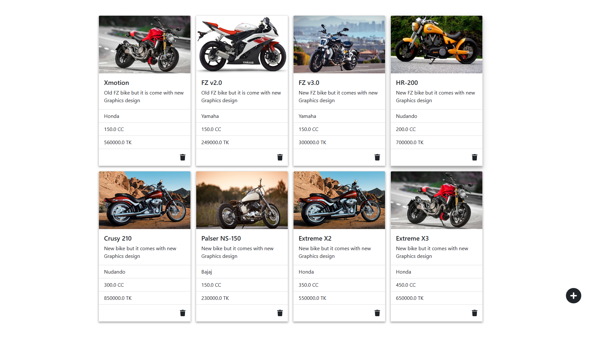

# Bike-Shop-Admin-Panel 🌴

---

Bike-Shop-Admin-Panel where we can add new bike with the bike image and delete bike. This project is built using JSP, Servlet and JDBC. MySql database are used. Servlet 3.0 partition (part) is used for getting uploaded image and saving it to the cloud server.

## project Video

---

## Project Image

